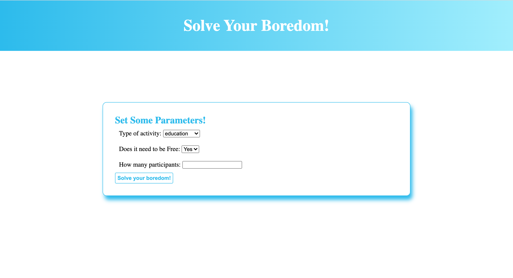

### ACC Software Bootcamp - Snap 2 Review

##### Saturday, June 19th 2021

# INSTRUCTIONS:

1. Make sure you put your phone on silent

2. Git clone this `Students_Jan_2021_Reviews` folder to your computer. If you already have it from a previous exam, then `git pull` within this repository's folder to update your local repository.

3. Copy this `02_Snap_2` folder over to your personal repository within github.com/ACCSoftwareBootcamp, so you may edit the contents there and commit/push them for grading.

   For example, get the questions from

   `github.com/ACCSoftwareBootcamp/Students_Jan_2021_Reviews/02_Snap_2`

   And push your answers to

   `github.com/ACCSoftwareBootcamp/YOUR_GITHUB_HANDLE/02_Snap_2`

4. This review has 1 part:
   1. **Practical (100%)**. There is one practical question you must answer to receive a passing grade. Please attempt it since partial credit is given!

5. Find all the bugs!!! This code does NOT work as written. Your goal is to find the bugs and make it work.

HINT: there are NO bugs in the `public` folder, the `views` folder, nor are there any bugs in the `package-lock.json` file. All other files are fair game.

Here are reference shots of what pages should look like:

Home page:

Result page (Please NOTE, your returned 'suggestion' may be different than screen shot - 'Learn Morse Code' was the result at the time of running this screen shot):

6. Please `git add`, `git commit`, `git push` your answers to your private ACCSoftwareBootcamp repository. There will be no grace time given after 10:00 am. Please complete as much as you can and commit/push your answers on or before time.

### INTEGRITY:

Some ground rules you are expected to follow:

- No sharing of direct or indirect answers.
- Absolutely no sharing of answer code.
- No sharing of url references, your peers can web search too.
- Any clarification from instructors should be posted on Slack under the **\#midterm** channel so that all students have access to the same clarification.

