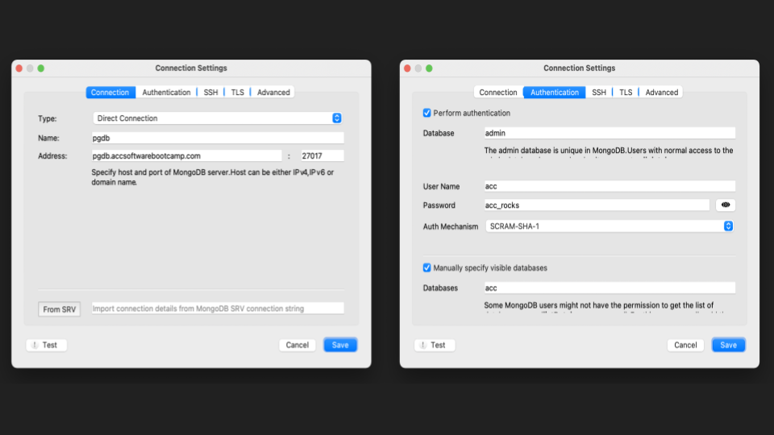

# MongoDB related questions. 

For testing these questions you may use your local mongo instance (remember to run it with the command `mongod`),
or use the class server. 

To access the class server, you may run the command

`mongo --username=acc --password=acc_rocks --authenticationDatabase=admin pgdb.accsoftwarebootcamp.com:27017/your_first_name`

Or, access the database using your Robo3T client using the following settings (all other settings are default):

Or, use the Mongo Atlas cluster you created earlier. 

## Question A:

Suppose you run the following code on a MongoDB database

    use INSERT_YOUR_FIRST_NAME_AS_DB_NAME_HERE
    db.animals.insert( { type : ['dog', 'cat'] } );
    db.animals.insert( { type :  ['cat'] } );
    db.animals.insert( { type : ['cow'] } );
    db.animals.insert( { egg: ['duck', 'hen', 'ostrich']  } );

On the data written above, write a mongo query that would return unique 
values of each of the keys
	- type, 
    - egg, 
    - hello // non existent

## Question B:

In the above database, how would you count the number of mongo documents which contain a type "cat".

Note: these questions may seem challenging, but are quite easy to research on the documentation and try a few
examples you may see online till you get an expected response. Git it a "Play". 